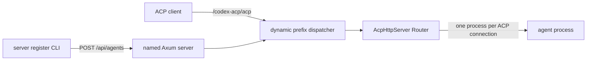

# Named server PR handoff

本文档用于交接 PR [#32](https://github.com/OpenInsightDev/acp-agent/pull/32) 在合并前仍需完成的工作。

文档基于当前分支 `codex/named-agent-servers`、提交 `b3039ff` 及独立代码审查结果编写。目标不是记录所有可能的长期增强，而是给下一位实现者一份可以直接执行的修复方案。

## 1. 当前结论

PR #32 目前不应直接合并。

现有实现采用以下进程模型：

1. `server start` 启动一个后台 Axum 反向代理进程。
2. `server register` 另行启动一个后台 `acp-agent serve` 进程。
3. CLI 将这个 `serve` 进程的临时端口和 PID 通过 `POST /api/agents` 注册到代理。
4. 代理用 `axum-reverse-proxy` 将 HTTP/SSE/WebSocket 请求转发到临时端口。
5. `unregister` 和 `stop` 根据持久化的裸 PID 终止 `serve` 进程。

这个方案已经能够通过基础 HTTP 和 WebSocket 测试，但引入了多个无法靠局部补丁彻底解决的问题：

- 裸 PID 可能复用，存在终止无关进程的风险。
- 代理崩溃后，detached `serve` 进程会成为孤儿进程。
- 临时端口存在释放后被抢占的竞态。
- distroless Docker 镜像中没有外部 `kill` 命令。
- WebSocket 被代理库终止并重新建立，无法保证 ACP 握手元数据完全透明。
- 普通 HTTP 反向代理还需要额外处理 hop-by-hop headers。
- 整个反向代理层实际上只是在同一台机器上连接两个 `acp-agent` HTTP 服务。

推荐在当前 PR 内调整架构，而不是继续修补这套进程代理模型。

## 2. PR #32 的合并前范围

当前 PR 必须完成：

- `server start --name <name>` 和 `server stop --name <name>`。
- `server register <agent-id> --name <name>` 和 `server unregister`。
- 默认 server name 为 `default`。
- 默认注册路由为 `/<agent-id>`。
- `/api/agents` 支持 POST 和 DELETE。
- 每个注册路由支持 ACP HTTP/SSE 和 WebSocket。
- 私有状态目录、状态文件和日志权限。
- 正确处理 IPv4、IPv6、通配监听地址和端口 `0`。
- 启动失败或超时时不遗留后台进程和错误状态。
- `server stop` 在存在长期 SSE/WebSocket 连接时仍能有界完成。
- 与上述行为对应的自动化测试和 README 文档。

以下内容已经拆为后续 issue，不应阻塞当前 PR：

- [#33](https://github.com/OpenInsightDev/acp-agent/issues/33)：`server list/status/registrations/logs` 等运维命令。
- [#34](https://github.com/OpenInsightDev/acp-agent/issues/34)：管理 API 的全部鉴权需求，包括本地控制凭据、远程认证、token 轮换、TLS 指引和限流。
- [#35](https://github.com/OpenInsightDev/acp-agent/issues/35)：跨进程锁、generation、并发 start 串行化和崩溃恢复。

当前 PR 明确不实现管理 API 鉴权。它仍需处理与鉴权无关的安全和正确性问题，例如宽松文件权限、任意 target 形成的 open proxy、裸 PID，以及确定会遗留进程的失败路径。

## 3. 推荐目标架构

### 3.1 核心变化

不要再为每个注册项启动独立的 `acp-agent serve` 进程。

命名 server 应在同一个 Axum 进程中维护一个动态表：

```text
route prefix -> agent ACP Router
```

每个 ACP Router 仍使用现有 `agent-client-protocol-http::AcpHttpServer`。该库会在实际 ACP 连接建立时启动对应的 agent 子进程，因此并没有取消 agent 进程隔离；取消的只是多余的中间 `serve` HTTP 进程和 localhost 反向代理。



### 3.2 该方案直接消除的问题

完成这个调整后，可以删除：

- `reserve_loopback_port`。
- `AgentRegistration.target`。
- `AgentRegistration.pid`。
- `terminate_process`。
- register 中启动 `acp-agent serve` 的全部代码。
- per-agent 后台日志文件。
- `axum-reverse-proxy` 依赖。
- 为代理使用的 `tower` 依赖；如果动态 Router 分发仍使用 `oneshot`，则保留 `tower`。
- HTTP hop-by-hop header 处理问题。
- WebSocket 二次握手和 close frame 透明性问题。
- PID 复用、端口抢占、distroless `kill` 和代理崩溃后遗留 `serve` 进程的问题。

命名 server 自身仍是后台进程。它的启动、状态文件和停止机制仍需保留并加固。

## 4. 复用现有 serve 实现

### 4.1 当前可复用内容

`src/commands/serve.rs` 已经包含：

- `ServeOptions`。
- `http_server_options` 参数校验。
- `AcpHttpServer` 的 agent factory。
- agent stderr 转发。
- `AgentHealth` 和 `/readyz`。
- CORS、health、subpath 处理。
- HTTP/SSE 和 WebSocket 集成测试 fixture。

当前 `serve_listener` 同时负责构造 Router 和运行 listener。为了让命名 server 复用，应将 Router 构造部分提取出来。

建议接口：

```rust
pub(crate) fn agent_router(
    config: AcpAgentConfig,
    options: &ServeOptions,
) -> Result<Router>;
```

或者：

```rust
pub(crate) struct AgentHttpService {
    pub router: Router,
}

pub(crate) fn build_agent_http_service(
    config: AcpAgentConfig,
    options: ServeOptions,
) -> Result<AgentHttpService>;
```

`serve_listener` 随后只做：

```rust
let router = agent_router(config, &options)?;
axum::serve(listener, router).await?;
```

不要在 `server.rs` 复制 `ObservedAgent`、`LaunchGuard`、`AgentHealth` 或 CORS 构造逻辑。

### 4.2 动态 Router 表

建议的数据结构：

```rust
#[derive(Clone)]
struct RegisteredAgent {
    agent_id: String,
    route: String,
    router: Router,
}

#[derive(Clone)]
struct ServerState {
    agents: Arc<RwLock<HashMap<String, RegisteredAgent>>>,
    shutdown: ShutdownHandle,
}
```

注册时：

1. 校验 agent ID、route 和 serve 参数。
2. 在 daemon 进程内解析 yolo 参数。
3. 调用 `runner::resolve_agent_config`。
4. 调用从 `serve.rs` 提取的 Router builder。
5. 在持有写锁时再次检查重复 ID 和重复 route。
6. 原子插入完整 `RegisteredAgent`。
7. 返回 `201 Created`。

解析 registry 或准备二进制可能耗时，不能在整个过程期间持有写锁。正确顺序是先构造 Router，再短暂获取锁执行重复检查和插入。并发注册相同 ID 时允许两边都完成准备，但只有一个成功插入，另一个返回 `409 Conflict`。

### 4.3 动态请求分发

Axum 的顶层 Router 保持固定：

```text
/health
/api/agents
/api/status
/api/shutdown
fallback -> dynamic agent dispatcher
```

dispatcher 应：

1. 根据完整 path 查找最长且满足 path segment boundary 的 route。
2. 例如 `/agent` 可以匹配 `/agent`、`/agent/acp`，但不能匹配 `/agent-two/acp`。
3. 将 URI 中的 route prefix 去掉。
4. 保留 query string、method、headers、body 和 request extensions。
5. clone 对应 Router，在释放读锁后调用 `oneshot(request)`。
6. 未匹配时返回 `404`。

释放读锁后再调用 Router 非常重要。SSE/WebSocket 请求可能长期不结束，不能让它们长期持有注册表锁，否则 unregister 会永久等待。

URI 示例：

```text
/codex-acp/acp?mode=test -> /acp?mode=test
/codex-acp/health        -> /health
/codex-acp/readyz        -> /readyz
```

对于恰好等于 route 的请求，可以重写成 `/`。ACP Router 通常会返回 `404`，这是合理行为。

WebSocket upgrade 必须直接交给目标 ACP Router。不要读取或重建 handshake，也不要创建第二个 WebSocket client。保留原始 request extensions 可确保 Hyper/Axum upgrade 状态仍然可用。

## 5. 管理 API 契约

### 5.1 POST /api/agents

当前 body 接受任意 `target` URL，这会形成 SSRF/open proxy。目标架构中不再接受 target，也不接受 PID。

建议 body：

```json
{
  "id": "codex-acp",
  "route": "/codex-acp",
  "serve": {
    "path": "/acp",
    "cors_origins": [],
    "allow_any_origin": false,
    "health_endpoint": true,
    "readyz_endpoint": true,
    "yolo": false,
    "args": ["--model", "gpt-5"]
  }
}
```

为了保持 API 简单，也可以将 serve 字段平铺。无论选择哪种形式，都应定义独立的 serde request DTO，不要直接暴露内部 `ServeOptions`。

建议响应：

- `201 Created`：注册成功。
- `400 Bad Request`：route、path、CORS 或参数不合法。
- `404 Not Found`：agent ID 不存在于 registry。
- `409 Conflict`：agent ID 或 route 已注册。
- `422 Unprocessable Entity`：agent 存在但无法构造 runnable config，可选；也可以统一为 `400`。
- `500 Internal Server Error`：状态写入等内部失败。
- `503 Service Unavailable`：registry 或安装依赖暂时不可用，可选。

错误响应最好使用统一 JSON：

```json
{
  "error": "route_conflict",
  "message": "route /codex-acp is already registered"
}
```

这不是长期公共 API 的完整设计，但比当前纯文本错误更容易测试和使用。

### 5.2 DELETE /api/agents

保持当前 body 即可：

```json
{
  "id": "codex-acp"
}
```

建议响应：

- `204 No Content`：删除成功。
- `404 Not Found`：agent 未注册。

删除只需从动态 Router 表移除条目。已经开始的连接持有 Router clone，可以选择自然结束；新请求立即返回 `404`。如果产品语义要求 unregister 强制断开现有连接，需要额外的 per-agent cancellation token，但当前需求没有明确要求，建议本 PR 采用“停止新连接，现有连接自然结束”。

### 5.3 register CLI

`server register` 不再启动子进程。它应：

1. 读取命名 server 的私有状态文件。
2. 检查 server 存活状态。
3. 根据 CLI 参数构造 POST body。
4. 调用 `/api/agents`。
5. 将 server 的结构化错误转换为带上下文的 CLI 错误。
6. 成功后输出公开路由 URL。

`--name`、`--route`/`--subpath`、`--path`、CORS、health、readyz、yolo 和尾随 agent args 均可保持当前 CLI 契约。

### 5.4 unregister CLI

`server unregister` 调用 `DELETE /api/agents` 并将结构化错误转换为 CLI 错误。鉴权留给 #34。

## 6. 鉴权明确不在当前 PR

根据当前范围决定，PR #32 不实现任何管理 API 鉴权要求。

以下内容全部由 [#34](https://github.com/OpenInsightDev/acp-agent/issues/34) 跟踪：

- 本地 CLI 与 daemon 之间的控制 token。
- `POST /api/agents` 和 `DELETE /api/agents` 的认证与授权。
- `/api/status` 和 `/api/shutdown` 的认证与授权。
- Bearer token 或其他 Authorization scheme。
- token 生成、保存、轮换、吊销和 constant-time comparison。
- 非 loopback 部署的凭据分发、TLS、限流和安全指引。
- `401`、`403` 及认证错误响应契约。
- 所有认证相关自动化测试。

因此当前 PR 的 handoff、实现顺序和验收标准都不应再要求 token、Bearer header 或认证测试。当前 API 暂时是未鉴权的管理接口，这是已知限制，而不是 PR #32 的漏项。

默认监听地址应继续保持 `127.0.0.1`，以降低未鉴权接口被意外暴露的概率。用户显式设置 `--host 0.0.0.0` 或其他非 loopback 地址时，当前 PR 可以输出风险警告，但不应在本 PR 中设计或实现凭据机制。例如：

```text
warning: unauthenticated server management endpoints are reachable on a non-loopback interface
```

该警告不构成鉴权，也不替代 #34。

## 7. 状态与日志权限

### 7.1 风险

普通 `tokio::fs::write` 在 Unix 上通常受 umask 影响，可能产生 `0644` 状态文件。后台日志可能包含 agent stderr、工作目录、可执行路径或环境诊断信息，因此即使鉴权需求已移至 #34，状态与日志仍应保持当前用户私有。

### 7.2 必须实现

Unix：

- server 状态目录：`0700`。
- server 状态文件：`0600`。
- server 日志文件：`0600`。
- 临时状态文件：`0600`。

Windows：

- 使用当前用户缓存目录的默认 ACL。
- 不要尝试用 Unix mode 模拟 ACL。
- 至少增加测试或注释明确平台行为。

建议封装：

```rust
fn open_private_file(path: &Path, append: bool) -> Result<std::fs::File>;
async fn write_private_json_atomic(path: &Path, value: &impl Serialize) -> Result<()>;
```

Unix 下用 `std::os::unix::fs::OpenOptionsExt::mode(0o600)`。目录创建后显式设置 `PermissionsExt::from_mode(0o700)`，同时避免意外放宽已有目录权限之外的父目录。

状态写入应采用同目录临时文件加 rename：

1. 以 `create_new(true)` 创建随机临时文件。
2. 写入完整 JSON。
3. `sync_all`，至少保证用户态缓冲已写出。
4. rename 到最终路径。
5. 出错时删除临时文件。

完整的 generation 和跨进程锁属于 #35，但当前 PR 至少不能留下部分 JSON，也不应让其他本地用户读取运行状态和日志。

## 8. 地址处理和启动失败清理

### 8.1 IPv6

当前 `control_url` 只特殊处理 `::`，对 `::1` 等 IPv6 地址会产生：

```text
http://::1:8010
```

这是无效 URL。

不要手工判断冒号和拼接 URL。使用 `reqwest::Url` 或标准 socket/address 类型构造：

```rust
let mut url = reqwest::Url::parse("http://localhost")?;
url.set_host(Some(connect_host))?;
url.set_port(Some(port))?;
```

注意监听 host 和 CLI 控制连接 host 不一定相同：

- `0.0.0.0` 应通过 `127.0.0.1` 控制。
- `::` 应通过 `::1` 控制。
- `::1` 应保持 `::1`，URL 库会负责方括号。
- 普通 hostname 保持原值。

建议状态文件同时保存：

```json
{
  "listen_host": "0.0.0.0",
  "control_url": "http://127.0.0.1:8010"
}
```

这样 CLI 无需重复推导规则。

### 8.2 start 超时和子进程提前退出

`server start` 仍需要启动一个后台 daemon。调用方持有 `tokio::process::Child`，因此失败路径必须明确回收：

- 子进程提前退出：`wait()` 回收并返回包含日志路径的错误。
- readiness 超时：先 `kill()`，再 `wait()`，然后仅删除本次启动写入的状态。
- 状态文件解析失败：在超时前继续等待短暂重试；最终按超时路径回收。
- readiness 返回的 server name 或协议版本不匹配：视为错误，回收本次 child，不能把端口上的其他服务当作成功。

不要在返回错误前只 drop `Child`。Tokio 默认 drop child handle 不保证终止进程。

### 8.3 daemon readiness

当前 `/api/status` 可以继续作为 readiness endpoint，但本 PR 不要求通过 token 认证它。readiness 至少应验证：

- HTTP 成功。
- 返回的 server name 与请求 name 一致。
- 返回结构的协议版本与当前 CLI 兼容。

可以返回：

```json
{
  "name": "default",
  "pid": 12345,
  "version": "0.0.4"
}
```

## 9. 有界 shutdown

### 9.1 当前问题

`axum::serve(...).with_graceful_shutdown(...)` 会停止接受新连接，但会等待所有活动连接结束。ACP 的 SSE 和 WebSocket 都可能长期存在，因此当前代码只有在所有连接自然关闭后才会执行状态清理。

CLI 的 `server stop` 等待十秒后返回超时，但 daemon 可能继续运行。这不符合 stop 的用户预期。

### 9.2 推荐实现

使用一个可被多个等待者观察的 shutdown primitive，例如：

- `tokio::sync::watch`
- `tokio_util::sync::CancellationToken`
- `broadcast` channel

流程：

1. `/api/shutdown` handler 触发 shutdown signal 并立即返回 `202 Accepted`。
2. Axum graceful shutdown 停止接收新连接。
3. daemon supervisor 从收到 signal 的时刻开始计算 grace period，例如 3–5 秒。
4. grace period 内允许普通请求结束。
5. 超时后 drop/abort serve future，使剩余 SSE/WebSocket 连接关闭。
6. 写入/删除状态完成后进程退出。

需要避免从进程启动时就开始 timeout。timeout 必须从 shutdown signal 触发时开始。

伪代码：

```rust
let server = axum::serve(listener, router)
    .with_graceful_shutdown(shutdown.cancelled_owned());
tokio::pin!(server);

tokio::select! {
    result = &mut server => result?,
    () = shutdown.cancelled() => {
        if tokio::time::timeout(SHUTDOWN_GRACE, &mut server).await.is_err() {
            // Dropping the pinned server future force-closes remaining connections.
        }
    }
}
```

实际代码需根据 Axum serve future 的类型调整，但语义应保持一致。

CLI stop 的等待时间应大于 daemon grace period，并留出状态清理余量。例如 daemon grace 为 3 秒，CLI timeout 可为 8–10 秒。

### 9.3 unregister 与活动连接

本 PR 建议 unregister 不强制断开已有连接：

- 从表移除后不再接受新连接。
- 已有 Router clone 继续工作直到连接结束。
- 全局 server stop 才强制关闭剩余连接。

如果后续需要按 agent 强制断开，应另行引入 per-agent cancellation，不要把它和当前修复混在一起。

## 10. 当前代码应删除或修改的区域

`src/commands/server.rs`：

- 删除 `AgentRegistration.target` 和 `pid`。
- 删除 `ProxyEntry` 中的 `axum_reverse_proxy::ReverseProxy`。
- 删除 `reserve_loopback_port`。
- 删除 register 中 `Command::new(executable).arg("serve")...`。
- 删除 `terminate_process` 的 Unix/Windows 实现。
- 删除 `clean_stale_agents` 中所有 PID 语义；目标架构下不再有 per-agent process state。
- 将 `ProxyEntry` 替换为持有 ACP Router 的 `RegisteredAgent`。
- 使用结构化请求和错误响应。
- 修正 `control_url` 和启动失败回收。
- 实现有界 shutdown。

`src/commands/serve.rs`：

- 提取可复用的 ACP Router builder。
- 保持现有 `serve` 命令行为不变。
- 为 builder 添加单元测试，确保 `serve_listener` 和 named server 使用相同配置逻辑。

`src/commands/mod.rs`：

- CLI 形状基本不变。
- `server register` dispatch 不再隐式管理 agent serve PID。
- 如果 yolo 参数在 daemon 中解析，确保 request DTO 原样携带 `yolo` 和用户 args。

`Cargo.toml`：

- 删除 `axum-reverse-proxy`。
- 根据 Router `oneshot` 实现决定是否保留直接 `tower` 依赖。
- 如果删除现有控制 token 后没有其他 UUID 用途，删除 `uuid` 依赖。
- 如果使用 `CancellationToken`，直接声明 `tokio-util` 依赖，不依赖传递性依赖。

`README.md`：

- `/api/agents` POST 示例不再包含 target。
- 明确管理 API 在当前版本中未鉴权，并链接 #34。
- 保留默认 `/<agent-id>/acp`、health 和 readyz 路径说明。
- 说明 unregister 对已有连接的语义。

## 11. 测试计划

### 11.1 CLI parsing

保留并扩展现有测试：

- `server start` 默认 name、host、port。
- 自定义 `--name`。
- register 默认 route。
- `--route` 和 `--subpath` alias。
- register 的 path、CORS、health、readyz、yolo 和尾随 args。
- unregister 默认 name。
- CORS 冲突参数。

### 11.2 管理 API 无鉴权行为

当前 PR 不添加认证测试。应测试未鉴权 API 的基本契约，避免后续 #34 无法区分认证变更与业务回归：

- POST 无 Authorization header 时按业务执行。
- DELETE 无 Authorization header 时按业务执行。
- `/api/status` 和 `/api/shutdown` 无 Authorization header 时按当前契约执行。
- README 明确这是暂时的未鉴权管理面，并链接 #34。

### 11.3 动态路由

- POST 注册后 `/agent/acp` 可以到达 ACP Router。
- `/agent-two/acp` 不会误匹配 `/agent`。
- 嵌套 route 使用最长前缀匹配。
- query string 保留。
- method、headers 和 body 保留。
- DELETE 后新请求返回 `404`。
- 重复 ID 返回 `409`。
- 重复 route 返回 `409`。
- `/api` 和 `/health` 冲突 route 返回 `400`。
- 非法 path/CORS 返回 `400`。

### 11.4 真实 ACP HTTP/SSE

不要只测试普通 echo upstream。复用 `serve.rs` 的 fixture agent：

- 通过 `/<route>/acp` 完成 initialize POST。
- 验证 `acp-connection-id`。
- 建立 SSE GET。
- 发送后续 JSON-RPC 请求。
- DELETE ACP connection。
- `/health` 和 `/readyz` 位于 route 下。
- agent spawn 失败能反映到 `readyz`。

### 11.5 真实 ACP WebSocket

- 连接 `ws://server/<route>/acp`。
- 完成 ACP initialize。
- 验证响应 header 中 ACP 所需元数据没有丢失。
- 发送后续请求并收到正确响应。
- 验证正常 close。

因为目标架构直接调用 ACP Router，这些行为应该与现有 `serve` WebSocket 测试一致。

### 11.6 shutdown

- 无活动连接时 stop 正常退出并删除状态。
- 存在活动 SSE 时，daemon 在 grace period 后退出。
- 存在活动 WebSocket 时，daemon 在 grace period 后退出。
- shutdown 后客户端连接被关闭。
- CLI stop 在预期时间内完成。

测试中的 grace period 应允许注入较短值，例如 50–200ms，避免拖慢 suite。

### 11.7 地址和失败清理

- `127.0.0.1`。
- `0.0.0.0` 控制连接映射到 loopback。
- `::1`。
- `::` 控制连接映射到 IPv6 loopback；CI 无 IPv6 时可条件跳过。
- port `0` 返回实际端口。
- 端口占用时不写入有效运行状态。
- hidden daemon 提前退出时 start 返回日志路径。
- readiness 超时时 child 被终止并 wait。
- 超时后没有状态文件和残留 daemon。

### 11.8 文件权限

Unix-only tests：

- 状态目录 mode 为 `0700`。
- 状态文件 mode 为 `0600`。
- 日志文件 mode 为 `0600`。
- 原子写入不会留下可被当作正式状态解析的部分文件。

测试应使用临时 cache root，而不是用户真实 cache 目录。为此建议允许内部 path helper 接受 root，或者在测试中通过依赖注入提供 `ServerPaths`。

## 12. 推荐实现顺序

按以下顺序可以减少返工：

1. 从 `serve.rs` 提取 ACP Router builder，并确保原有 serve 测试全部通过。
2. 定义新的 register/unregister API DTO 和统一错误类型。
3. 将 `server.rs` 的 `ProxyEntry` 改为动态 ACP Router entry。
4. 修改 register CLI，删除 `serve` 子进程、PID、端口和代理逻辑。
5. 删除 `axum-reverse-proxy` 及相关依赖。
6. 引入私有、原子状态文件 helper，并让测试可注入 cache root。
7. 用 URL API 重写 listen/control address 处理。
8. 补齐 start 失败时的 child kill + wait。
9. 实现有界 graceful shutdown。
10. 将现有普通 HTTP/WebSocket proxy 测试替换为真实 ACP Router 测试。
11. 更新 README 和 PR 描述，明确鉴权由 #34 跟踪。
12. 运行完整验证与真实 CLI smoke test。

每完成一个阶段都应保持 `serve` 原有行为和测试不回退。

## 13. 验收标准

PR #32 在满足以下条件后可以重新请求审查：

- 不再启动或管理 per-agent `acp-agent serve` 后台进程。
- 不再保存或接受 agent PID。
- 不再接受任意代理 target URL。
- 不再依赖 `axum-reverse-proxy`。
- 状态目录、状态文件和日志在 Unix 上不可被其他用户读取。
- 默认 route 和所有 serve-like 参数按文档工作。
- HTTP/SSE 和 WebSocket 均通过真实 ACP fixture 验证。
- 活动 SSE/WebSocket 不会让 stop 无限等待。
- IPv6 control URL 正确。
- 所有 start 失败路径都会回收 child 并清理本次状态。
- `cargo fmt --check` 通过。
- `cargo clippy --all-targets --all-features -- -D warnings` 通过。
- `cargo test --all-targets` 通过。
- 手工完成一次 `start -> register -> ACP request -> unregister -> stop`。
- 工作区和 cache 中没有残留测试 daemon、状态或 agent serve 进程。

## 14. 明确不在本 PR 解决的问题

为避免 scope 再次膨胀，下列内容只保留基本兼容点，不在本 PR 完整实现：

- 多 CLI 并发启动的强串行化和文件锁：#35。
- daemon SIGKILL 后恢复注册表：#35。
- generation 和跨进程状态仲裁：#35。
- 所有管理 API 鉴权，包括本地 token、远程凭据、授权、轮换、TLS 和限流：#34。
- server list/status/logs/registrations 用户命令：#33。
- unregister 强制取消已有 agent 连接。
- 注册状态跨 daemon 重启自动恢复。
- systemd、launchd、Windows Service 或全局常驻 daemon 集成。

当前 PR 明确允许未鉴权 endpoint；该限制由 #34 跟踪。后续 issue 仍不能成为保留裸 PID、任意 target open proxy、宽松文件权限或无界 stop 的理由，因为这些问题与鉴权无关。

## 15. 实现决策记录

交接时建议默认采用以下决策，除非维护者明确要求更改：

- named server 是每个 name 一个后台进程，不增加全局 daemon。
- agent HTTP Router 嵌入 named server，不增加 per-agent serve 进程。
- register request 传 agent ID 和 serve options，不传可执行命令、环境变量、PID 或 target URL。
- daemon 负责 registry resolution 和 agent config 构造。
- 当前管理 API 不鉴权；全部鉴权设计和实现统一留给 #34。
- unregister 只阻止新连接，已有连接自然结束。
- server stop 先 graceful，短 grace period 后强制关闭剩余连接。
- 状态目录和文件默认仅当前用户可访问。
- 长期远程管理、安全部署和 crash recovery 留给已经建立的 issue。

这些决策使实现与现有 `serve` 行为保持一致，同时最大限度删除只为本机 localhost 代理产生的复杂度。
